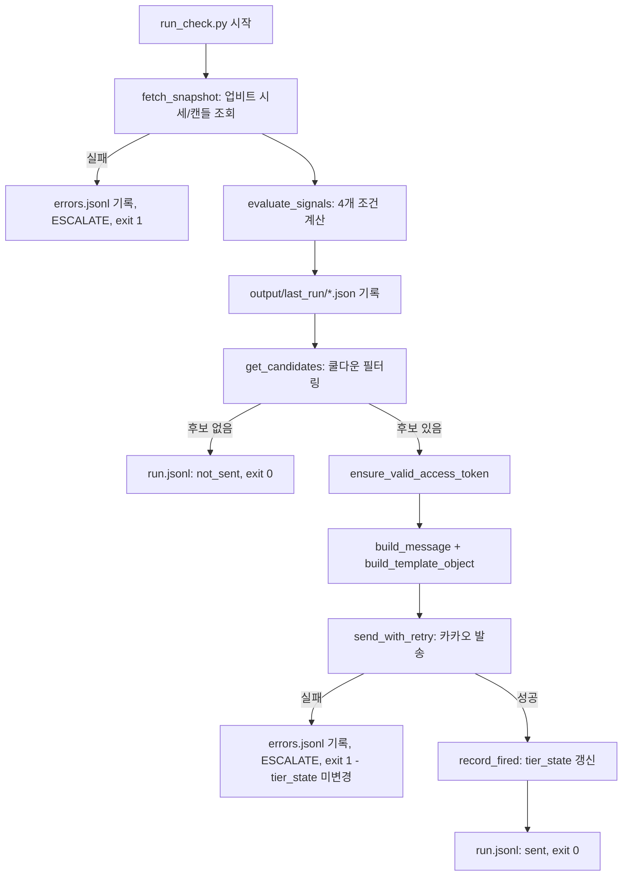

# Bitcoinalert 설계 문서

## 1. 배경 및 목적

업비트 KRW-BTC 시세를 5분 주기로 감시하여 급격한 가격 변동(5분/1시간/24시간) 또는 거래량 급증이 감지되면 카카오톡 "나에게 보내기"로 알림을 보내는 개인용 에이전틱 시스템이다. 자매 프로젝트 "Stockalert(주식변동알리미)"와 같은 `.claude/skills` 구조를 따르되, 24시간 돌아가는 암호화폐 시장에 맞게 재설계했다.

## 2. 범위 (v1)

- 단일 마켓: `KRW-BTC`
- 4가지 조건: 5분 ±1%, 1시간 ±3%, 24시간 ±5%, 거래량 급증(20구간 이동평균 대비 3배)
- 단일 알림 채널: 카카오톡 나에게 보내기
- LLM 기반 원인 분석 없음 (아래 3절 참고)

## 3. 왜 Stockalert와 다른가

| Stockalert | Bitcoinalert | 이유 |
|---|---|---|
| 하루 1회, 장마감 후 실행 | 5분마다 폴링 (288회/일) | 코인 시장은 24시간 열려있어 "장마감" 개념이 없음 |
| evidence-collector + cause-analyst(LLM)로 SEC 공시/뉴스 원인 분석 | 원인 분석 없음, 100% 결정론적 계산 | 5분 주기에 매번 LLM 호출은 비용/실익 면에서 과함. 5분 단위 변동은 대부분 뉴스로 설명 불가 |
| `output/{target_date}/...` 날짜별 디렉토리 | `output/last_run/` 덮어쓰기 + 로그 + SQLite | 5분 주기면 날짜별 디렉토리가 연간 10만개 생성됨 |
| `runs`/`trigger_events`/`attributions` 3테이블 | `tier_state` 1테이블 | 원인 분석이 없으므로 이력 스키마도 단순화 |
| 우선순위 캐스케이드 (한 티커당 하나의 determination_method) | 4개 조건 독립 동시 트리거 | 짧은 시간에 여러 조건이 동시에 만족될 수 있음 (예: 급락 + 거래량 급증) |

## 4. 워크플로우

## 5. 구현 스펙 요약

- 스킬 2개: `price-watcher`(조회+계산+쿨다운 필터), `kakao-notifier`(토큰관리+발송+기록). 각 `SKILL.md` 참고.
- `config/thresholds.yaml`: 4개 조건의 임계값/쿨다운 시간, HTTP 재시도 설정.
- `output/history.db`의 `tier_state` 테이블 1개로 쿨다운 판단 (발송 성공 후에만 갱신 → 실패 시 다음 폴링에서 자연 재시도).
- 카카오 OAuth: 최초 1회 `kakao_auth_setup.py`로 수동 인증, 이후 `refresh_access_token.py`가 만료 임박(30분 여유) 시에만 자동 갱신.
- 스케줄링: Windows Task Scheduler로 5분마다 `run_check.py` 실행 (매 실행이 독립 프로세스라 크래시 격리, 로그오프 후에도 생존 설정 가능).

## 6. 알려진 한계 / 향후 과제

- 단일 마켓(KRW-BTC)만 지원. 다중 코인 확장 시 `config/markets.yaml` 분리 필요.
- "왜 움직였는지" 설명 없음 — v2에서 무료 크립토 뉴스 RSS 조회 정도의 경량 컨텍스트 추가를 고려할 수 있음(LLM 원인분석까지는 불필요).
- 카카오 "나에게 보내기" 기본 text 템플릿 글자수 제한 — 다수 tier 동시 트리거 시 표시 개수 제한 로직이 `render_message.py`에 없음(현재는 전부 표시). 실사용 중 메시지가 잘리면 상위 2~3개만 표시하도록 조정.
- refresh_token 만료(약 2개월) 시 `kakao_auth_setup.py` 재실행 필요 — 자동 알림 없음. 운영 중 `errors.jsonl`에서 인증 실패를 주기적으로 확인할 것.
